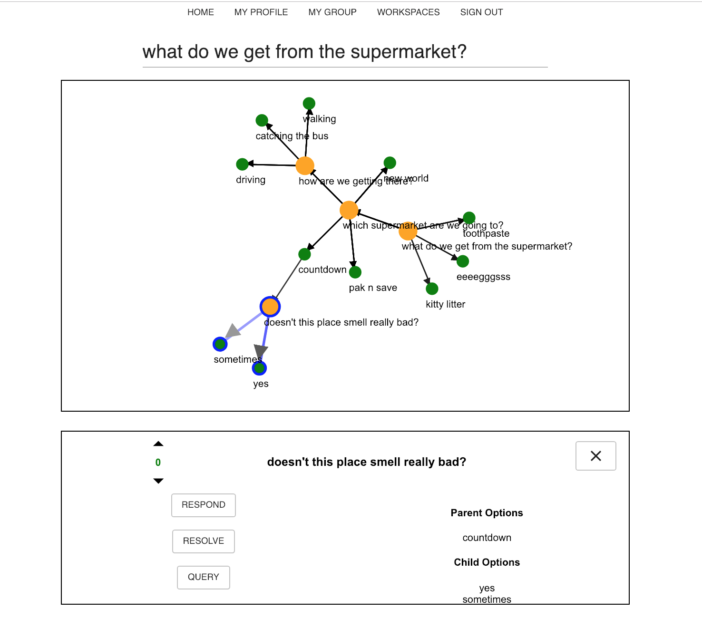

# glass.trees

realtime multiagent coordination toy

## theoretical premises and conflations (confabulations?)

- interaction as computation as coordination as game as dialogue
- interaction game as proceeding via ATTACKING (questioning) and DEFENDING (answering)
  - proofs and counterproofs
  - inherently dialogical
- interaction as the decomposition and recomposition of possibilities
  - fragmentation as the generation of new questions and answers from those existing
  - integration as resolution of questions (reduction, normalization, abstraction, compression?) and their corresponding answers

## theoretical inspirations (poorly co-opted, half-digested spirits)

- reza negarestani: intelligence and spirit
- jonathan ginzburg: the interactive stance
- alain lecomte: figures of dialogue: a view from ludics

## rules

- each workspace must begin with a question
- agent can either QUERY or RESPOND to a question
- QUERY means asking a question of the question
- RESPOND means providing a possible answer ("option") to the question
- agent can also QUERY any option
- agent can UPVOTE or DOWNVOTE any query or option
- RESOLVE means that the author of the question is satisfied with the information at hand
- anyone can UN-RESOLVE or REOPEN a resolved question

## notes

- there is NO AUTOMATION of resolution - this is entirely up to the author of the question, and can be vetoed by any other agent
  - for ludics fans, this means there is no `daimon` move: 'winning' means no one vetoes your resolution
  - upvoting and downvoting are simply there to provide additional information on the other agents' preferences

## bugs

- MAJOR: 401s due to tokens expiring should trigger a cache renewal of credentials

## TODOs and upcoming features

- refactor graph component code, which is a mess
- each user can have many groups
- usernames
- nodes editable by respective author
- ability to start a workspace with an assertion (to be interrogated, vetted etc.)
- UI should be more HUD-like
- avatars
- emojis
